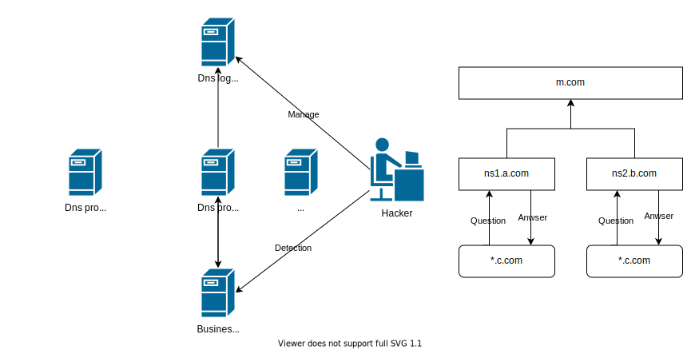

# 简介

    nslog是使用java编写的Dns解析记录项目，简单配置后就可以绕过基于dns检测的waf，并且为渗透测试人员提供方便快捷的Rest API用于定制化漏洞探测发现。

# 原理

    使用nslog至少需要两个域名，一个域名用作 NS 服务(例：a.com/b.com)，一个用作触发Dns解析(例: c.com)
    为方便理解原理，定义了以下几个角色：

|  角色   | 域名  | 地址  |
|  ----  | ----  | ----  |
| 管理 | m.com | 1.2.3.1 |
| NS节点 | a.com | 1.2.3.2 |
| NS节点 | b.com | 1.2.3.3 |
| 触点 | c.com | 1.2.3.4 |
    
### 管理：
    与NS节点可使用同一个域名，为保护NS域名建议使用不同域名
### NS节点（1个或N个）：
    作为域名解析节点，经过递归或迭代最终域名解析会在此服务器查询地址记录。
    当域名被waf、ips和ids等安全设备标记时，可以快速创建新的`NS节点`绕过检测。
    与传统的dnslog不同，`NS节点`采集到的dns解析记录可以使用非对称加密方式发送到`管理`，`管理`无法解密数据保护测试数据安全。
### 触点：
    利用dns解析特性发送域名解析请求到NS节点
    客户端访问 *.c.com 域名时，经过N次递归或迭代后最终询问`NS节点`产生一条记录即dns log。

# 搭建

## 域名准备
### 域名m.com增加一条A记录（可与NS节点域名相同）：

    m.com.		3600	IN	A	1.2.3.1

### 域名a.com增加两条A记录（主备dns）：

    ns1.a.com.		3600	IN	A	1.2.3.2
    ns2.a.com.		3600	IN	A	1.2.3.2

### 域名c.com在运营商处修改NS记录：

    主：ns1.a.com
    备：ns2.a.com

设置完以上几项域名准备已完成，注意：NS记录修改后会有24-48小时不等的延迟，不是立即生效

## nslog配置

# 参考
 - [What is DNS](https://www.cloudflare.com/learning/dns/what-is-dns/)
 - [What is a DNS A record](https://www.cloudflare.com/learning/dns/dns-records/dns-a-record/)
 - [What is a DNS NS record](https://www.cloudflare.com/learning/dns/dns-records/dns-ns-record/)
 